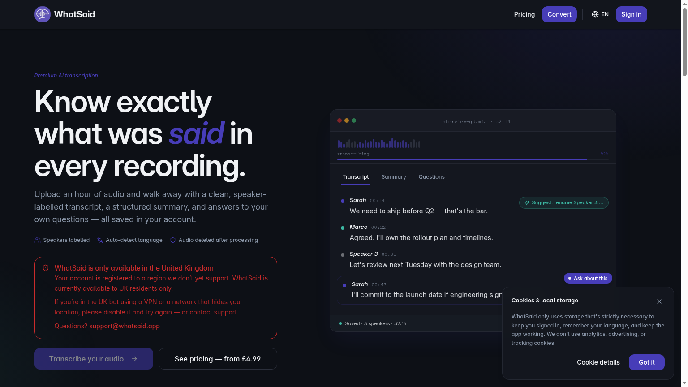
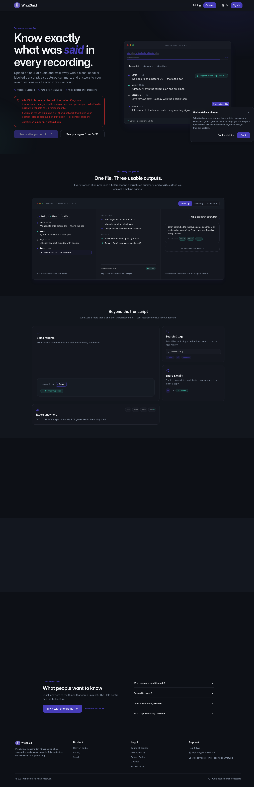
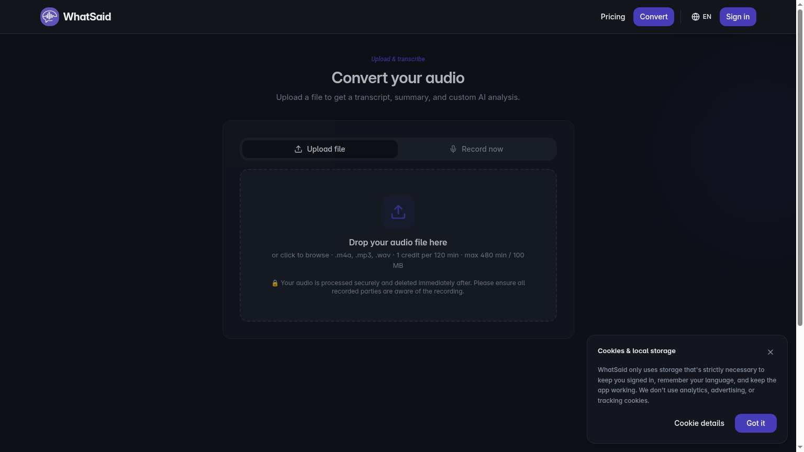
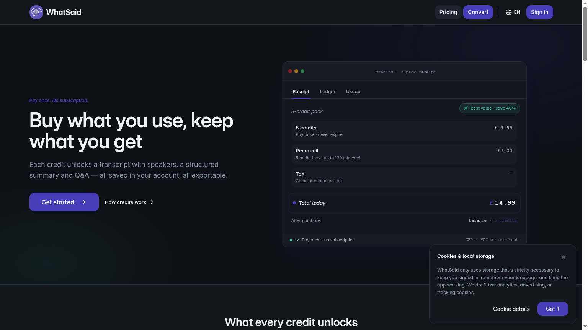

# WhatSaid

### Know exactly *what was said* in every recording.

Premium AI audio transcription with speaker labels, structured summaries, and a Q&A surface you can ask anything against — all saved to your account, privacy-first, audio deleted after processing.

  
  
  
  
  
  
  
  
  

---

## ✨ About the project

**WhatSaid** is a production-grade SaaS I designed and built end-to-end — product, UX, frontend, backend, billing, infrastructure and launch readiness. It turns long-form audio (meetings, interviews, voice notes) into something you can actually *use*: a clean speaker-labelled transcript, a structured summary with key points and actions, and a Q&A surface you can interrogate with your own prompts.

The brief I set for myself was deliberately not "another transcription wrapper". It was:

> *Build the kind of calm, premium, corporate-friendly tool a consultant or founder would trust with a confidential interview — and do it under real constraints: regulated payments, EU/UK privacy, zero audio retention, async jobs that can run for tens of minutes, and a UI that has to feel inevitable in both light and dark mode.*

Everything in this repository — schema, edge functions, design system, email templates, audit logs, admin tooling, compliance pages — exists because the product needed it to ship.

---

## 🎯 What it does

| | |
|---|---|
| 🎙️ **Transcribe** | Upload `.m4a`, `.mp3`, or `.wav` up to 480 minutes / 100 MB. Auto language detection, speaker diarisation, manual override. |
| 🧠 **Summarise** | Structured summary with key points and concrete actions, regenerated live when you edit the transcript. |
| ❓ **Ask** | A Q&A surface over one transcript or many — answers are cited back to the exact timestamps they came from. |
| ✍️ **Refine** | Rename speakers, fix mistakes inline; the summary and citations stay in sync. |
| 📤 **Export** | TXT, JSON, DOCX synchronously, PDF generated in the background. |
| 🔗 **Share & revoke** | Email a transcript via a tokenised link, revoke access with a reason, audit every view. |
| 💳 **Pay your way** | One-off guest checkout *or* prepaid credit packs that never expire. Paddle as merchant of record. |
| 🔐 **Privacy-first** | Audio is deleted immediately after processing. No analytics. No ads. No tracking cookies. |

---

## 📸 A look around

### Convert — upload or record, then walk away
The whole product is built around a single, deliberate primary action. No dashboards to learn, no settings to configure.

### Pricing — pay once, keep what you get
A receipt-style mock makes the offer concrete *before* the user gets to checkout. No subscriptions, no expiring credits, VAT calculated honestly at checkout.

---

## 🧱 How it's built

**Frontend** &nbsp;·&nbsp; Vite + React 18 + TypeScript + Tailwind + shadcn/ui, with a hand-rolled token-based design system (semantic HSL tokens, dark mode following system preference, Liquid-Glass surfaces used with restraint). Routing with `react-router-dom`, i18n with `i18next` (EN / FR / IT), session-aware scroll reveal, accessibility-first components throughout.

**Backend** &nbsp;·&nbsp; Lovable Cloud (Supabase) — Postgres with row-level security on every public table, an `app_role` enum + `has_role()` security-definer pattern to make admin checks injection-proof, and a fleet of Deno **edge functions** orchestrating uploads, transcription, post-processing, share links, revocations, audit exports and admin email previews.

**AI** &nbsp;·&nbsp; **AssemblyAI** for speech-to-text (diarisation, language detection, async polling). **Lovable AI Gateway** for the summary, Q&A and custom-prompt layer on top of the transcript.

**Payments** &nbsp;·&nbsp; **Paddle** as merchant of record — handles VAT/sales tax across jurisdictions, webhook-driven credit ledger, atomic credit deduction guarded against race conditions.

**Storage & lifecycle** &nbsp;·&nbsp; Audio lands in private temporary storage, is streamed to the STT provider, and is deleted the moment the job completes. Transcripts, summaries, Q&A and metadata are retained against the user's account; raw audio never is.

**Email** &nbsp;·&nbsp; Custom transactional templates with hardened subject sanitisation, length-capped fields, XSS-safe HTML escaping, and an internal admin preview page so every revocation scenario can be reviewed before it ever reaches an inbox.

**Tooling & quality** &nbsp;·&nbsp; Vitest unit tests, custom drift-detection scripts (design tokens, capability docs, FAQ coverage, security headers), a GitHub Actions security linter, runbooks for breach response and launch readiness.

---

## 🏛️ Engineering highlights I'm proud of

- **Zero-retention audio pipeline** — the file is in our control for minutes, not days, and the UI says so on every surface.
- **Roles done right** — separate `user_roles` table + `has_role()` security-definer function, never roles on profiles. No privilege escalation paths.
- **Atomic credit ledger** — credits are debited inside a transaction with a uniqueness guard so a double-clicked button can never charge twice.
- **Async job model** — `pending → queued → processing → completed | failed` with heartbeats, a watchdog, and an admin diagnostics tab to see exactly where any job is.
- **Share-and-revoke with receipts** — tokenised public share links, owner-initiated revocation with optional reason and revoker identity, a downloadable JSON/TXT/PDF audit log of every view.
- **Region & consent gates** — UK-only launch enforced server-side, EU Reg 37 consent dialog, granular cookie inventory, a fully translated legal corner.
- **Design system, not "design"** — every colour, gradient and shadow is a semantic token in `index.css`; no `text-white` / `bg-[#...]` lives in components. Light and dark are equally polished, both audited for WCAG contrast.
- **The boring stuff, on purpose** — sitemap, structured data (`SoftwareApplication`, `FAQPage`), canonical tags, security headers, breach runbook, launch-readiness checklist, drift checks in CI.

---

## 🧭 Roadmap shipped so far

- ✅ Guest one-off checkout *and* signed-in credit packs
- ✅ Speaker diarisation, language auto-detect, manual override
- ✅ Inline transcript editor with live summary sync
- ✅ Multi-transcript Q&A with citation timestamps
- ✅ TXT / JSON / DOCX / PDF export
- ✅ Tokenised share links + revoke + audit log
- ✅ Admin panel: usage, diagnostics, edge health, retention monitor, watchdog, email previews
- ✅ EN / FR / IT localisation
- ✅ Paddle integration as merchant of record (replacing Stripe mid-build)
- ✅ Full privacy / cookies / refund / accessibility legal set

---

## 👋 About me

I'm **Fabio Petito** — I design and ship calm, premium software end-to-end. WhatSaid is one of the products I trade as.

If you're a recruiter or hiring manager and you'd like to talk about the product, the architecture, or the trade-offs behind any of it, I'd genuinely enjoy the conversation.

📬 [support@whatsaid.app](mailto:support@whatsaid.app)

---

© 2026 WhatSaid · Operated by Fabio Petito, trading as WhatSaid · Audio deleted after processing.

