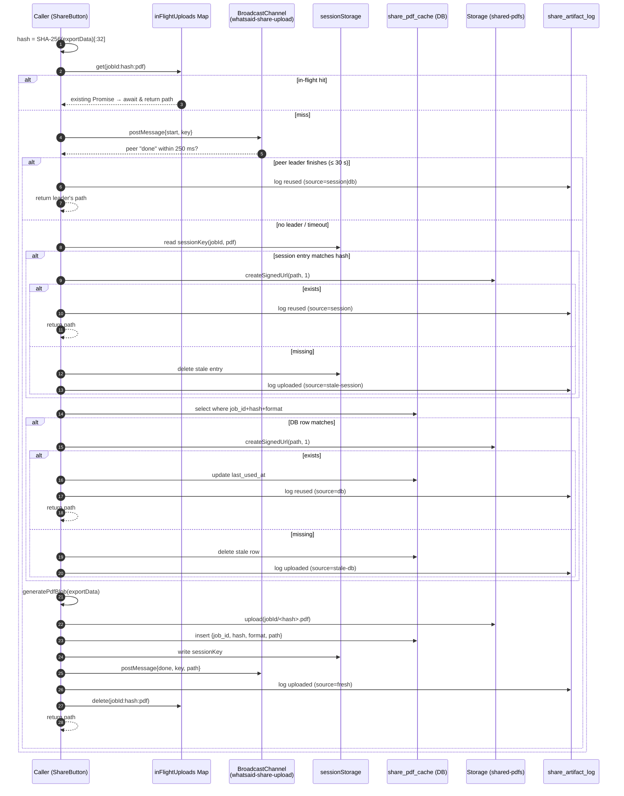

# WhatSaid — Architecture

> Living reference for the WhatSaid web app. Source of truth for runtime
> behaviour, data model, branding, and conventions. Update this file when
> any of the listed surfaces change.

---

## 1. Product overview

WhatSaid converts uploaded audio (`.m4a`, `.mp3`, `.wav` — up to 100 MB,
≤ 480 minutes) into:

1. A full transcript with timestamps and speaker labels.
2. A structured summary (key points + key actions).
3. Q&A answers grounded on the transcript.
4. Tags, title, recording date / location metadata.

Two flows:

- **Account flow** (primary): users sign up, buy credit packs, persist a
  history of jobs, share results.
- **Guest flow** (currently disabled in pricing UI): one-off pay-per-job
  upload-first / pay-later via guest token.

Audio is **deleted from storage immediately after processing**
(`audio_deleted_at` is recorded on the `jobs` row). Only generated text +
metadata is retained.

**Region restriction.** WhatSaid is **UK-only by policy**. Signup, login,
invite redemption, and Paddle checkout are all hard-gated to country
code `GB` (ISO-3166-1 alpha-2). The gate is enforced at four layers:
client UI (`Signup`, `Login`, `AuthContext`), edge functions
(`validate-signup-country`, `check-login-region`, `geo-check`), the
Paddle billing address (`paddle-checkout.ts` forces
`countryCode: "GB"` and `paddle-webhook` rejects non-GB transactions),
and the database (`profiles.country` ISO-2 `CHECK` + immutability
trigger). The policy is fail-closed: when the source IP region cannot
be determined, the request is rejected with a "region not verified"
message.


---

## 2. Tech stack

| Layer | Technology |
|---|---|
| Build | Vite 5 + React 18 + TypeScript 5 |
| UI | Tailwind CSS v3 + shadcn/ui (Radix primitives) |
| State | `@tanstack/react-query`, React Context (Auth, Notifications) |
| Routing | `react-router-dom` |
| i18n | `react-i18next` (EN, IT, FR) |
| Backend | Lovable Cloud (Supabase: Postgres + Auth + Storage + Edge Functions) |
| STT | AssemblyAI (via the `transcribe` edge function) |
| LLM post-processing | Lovable AI Gateway (Gemini / GPT-5 family) |
| Payments | Paddle (merchant of record) — see `paddle-webhook` |
| Email | Internal queue (`pgmq`) drained by `process-email-queue` |
| TTS playback | Browser `SpeechSynthesis` (no server audio) |

---

## 3. Top-level routes

Defined in `src/App.tsx`. All non-landing routes are lazy-loaded.

| Path | Component | Purpose |
|---|---|---|
| `/` | `pages/Index` | Landing |
| `/login`, `/signup`, `/reset-password`, `/set-password` | auth pages | Email + Google OAuth |
| `/convert` | `pages/Convert` | Upload audio, choose language / template |
| `/history` | `pages/History` | Filterable list of past jobs |
| `/job/:id` | `pages/JobDetail` | Tabs: Transcript / Summary / Questions; Listen, Copy, Export, Share |
| `/profile` | `pages/Profile` | Avatar, display name, stats |
| `/settings` | `pages/Settings` | Account, UI language, **Listening (voice + speed)**, password, danger zone |
| `/pricing` | `pages/Pricing` | Credit packs |
| `/notifications` | `pages/Notifications` | Async job & PDF export notifications |
| `/help` | `pages/Help` | Capabilities, workflow, FAQ, troubleshooting |
| `/admin` | `pages/Admin` | Admin-only: edge logs, templates, watchdog, FAQ feedback |
| `/claim/:token` | `pages/ClaimShare` | Recipient claims a shared transcript |
| `/shared-pdf/:token` | `pages/SharedPdfDownload` | One-shot signed PDF download |
| `/privacy`, `/terms`, `/refund-policy` | static legal pages | |

Providers wrap the tree in this order:
`QueryClientProvider → TooltipProvider → BrowserRouter → AuthProvider →
NotificationsProvider`.

---

## 4. Branding & design system

The visual system is centralised in **`src/index.css`** (CSS custom
properties, all HSL) and **`tailwind.config.ts`** (token mapping +
typographic scale). Components must consume semantic tokens
(`bg-primary`, `text-foreground`, etc.) — never hard-coded colors.

### 4.1 Colors (semantic tokens)

All values are HSL triplets stored as `--token: H S% L%` and consumed via
`hsl(var(--token))`.

| Token | Light | Dark | Usage |
|---|---|---|---|
| `--background` | `220 20% 97%` | `225 25% 7%` | App canvas |
| `--foreground` | `220 25% 10%` | `210 20% 95%` | Primary text |
| `--card` | `0 0% 100%` | `225 20% 10%` | Card surfaces |
| `--popover` | `0 0% 100%` | `225 20% 10%` | Popovers, menus, tooltips |
| **`--primary`** | **`245 50% 48%`** | **`245 60% 64%`** | **Brand indigo** — CTAs, focus ring |
| `--primary-foreground` | `0 0% 100%` | `0 0% 100%` | On-primary text |
| `--secondary` | `220 15% 93%` | `225 18% 15%` | Subtle surfaces |
| `--muted` | `220 15% 95%` | `225 18% 15%` | Quiet backgrounds |
| `--muted-foreground` | `220 10% 45%` | `215 15% 60%` | Helper text, captions |
| **`--accent`** | **`170 55% 42%`** | **`170 50% 48%`** | **Brand teal** — secondary highlights |
| `--destructive` | `0 72% 55%` | `0 65% 48%` | Delete / danger |
| `--success` | `145 60% 38%` | `145 50% 42%` | Success states |
| `--warning` | `38 90% 50%` | `38 80% 52%` | Warning states |
| `--info` | `210 60% 50%` | `210 55% 55%` | Informational |
| `--border`, `--input` | `220 15% 88%` | `225 15% 20%` | Hairlines, inputs |
| `--ring` | matches `--primary` | matches `--primary` | Focus ring |

A `--sidebar-*` mirror set is reserved for the optional shadcn sidebar
component.

`--radius: 0.75rem` drives the Tailwind border-radius scale.

### 4.2 Typography

Two web families only, declared in `tailwind.config.ts → fontFamily`:

| Family | Tailwind alias | Purpose |
|---|---|---|
| **Inter** (variable) | `font-sans` (default) | UI chrome, headings, navigation, form labels, timestamps |
| **Source Serif 4** (variable, optical-size) | `font-serif` | Long-form reading: transcript body, summary, Q&A |

Mono uses the **system stack** (`ui-monospace, SFMono-Regular, …`). No
third loaded family. A `Source Serif 4 Fallback` `@font-face` (mapping
to local Georgia with `size-adjust: 102%`) is registered to minimise CLS
during font swap.

Type scale (`tailwind.config.ts → fontSize`):

| Token | Size | Line | Weight | Use |
|---|---|---|---|---|
| `display` | 2.25rem | 1.05 | 600 | Hero headline |
| `h1` | 1.5rem | 1.2 | 600 | Page title |
| `h2` | 1.125rem | 1.3 | 600 | Card title |
| `h3` | 1rem | 1.35 | 600 | Subsection |
| `reading` | 1rem | 1.7 | 400 | Long-form (paired with `font-serif`) |
| `body` | 0.9375rem | 1.6 | 400 | Default body |
| `body-sm` | 0.8125rem | 1.5 | 400 | Dense UI text |
| `caption` | 0.75rem | 1.4 | 500 | Helper text |
| `micro` | 0.6875rem | 1.3 | 600 (tracked +0.04em) | Labels / overlines |
| `button`, `button-sm` | 0.875rem / 0.8125rem | 1 | 500 | Buttons |

Body has `font-feature-settings: "ss01", "cv11", "cv05"` enabled for
Inter's stylistic alternates; `.font-serif` opts into `kern, liga, calt`.

### 4.3 Motion

- Page transitions: `.animate-page-enter` (translate + fade) for landing,
  `.animate-page-enter-flat` (fade only) for app pages.
- Decorative animations: `pulse-ring`, `slide-down`, `waveform-scroll`,
  `progress-fill-92`, `hero-mock-rise`, `hero-text-rise` (defined in
  `tailwind.config.ts`).
- All non-functional motion is suppressed via a
  `@media (prefers-reduced-motion: reduce)` block; `animate-spin` and
  Radix interaction transitions are preserved.

### 4.4 Glass / depth

Reserved for the navbar only — `.glass-navbar` (light / dark) provides
backdrop-filter blur + saturate. Other surfaces stay solid for legibility.

### 4.5 Focus & interaction

Global `:focus-visible` ring: 2px background offset + 2px `--ring` halo.
Buttons get `transform: scale(0.98)` on `:active`. Tap targets ≥ 44 px on
mobile.

---

## 5. Data model

All tables live in the `public` schema. RLS is enabled everywhere; users
can only access their own rows except where noted. Roles are stored in a
**dedicated `user_roles` table**, never on `profiles`.

### 5.1 Identity & roles

- **`profiles`** — one row per user. Editable fields:
  `display_name`, `email` (contact), `avatar_url`, `ui_language`
  (`en`|`it`|`fr`), `needs_password_setup`, **`preferred_voice`** (`'male'|'female'`,
  default `'female'`, `CHECK`), **`playback_speed`** (`real`, default
  `1.0`, `CHECK IN (0.75, 1.0, 1.25, 1.5)`), **`country`** (ISO-3166-1
  alpha-2, `CHECK '^[A-Z]{2}$'`, **immutable** once set via the
  `trg_profiles_lock_country` trigger). `country` is populated by
  `handle_new_user` from signup metadata and backfilled by
  `check-login-region` on first verified login.
  RLS: user can `SELECT` / `INSERT` / `UPDATE` own row (`auth.uid() =
  user_id`); no `DELETE`.
- **`user_roles`** — `(user_id, role)` with `app_role` enum
  (`admin | moderator | user`). Admin-only management; users can read
  their own roles. Use the `private.has_role(_user_id, _role)`
  security-definer function in RLS predicates to avoid recursion (moved
  out of `public` so it is not callable via the Data API / REST).


### 5.2 Credits & billing

**Credit model (source of truth: `src/lib/pricing.ts → creditsForDuration`).**
Pricing is **per file**, not per minute or per bracket: a single credit
buys a full transcription for any file up to **120 minutes**. Files
longer than 120 min cost **+1 credit per additional 120-min block**.
The hard ceiling per file is **480 minutes** (`MAX_DURATION = 480 * 60`
in `src/lib/pricing.ts`), so a single upload can cost at most 4 credits.

```
creditsForDuration(seconds) = max(1, ceil(seconds / 60 / 120))
```

| Duration | Credits charged |
|---|---|
| 0 – 120 min | 1 |
| 121 – 240 min | 2 |
| 241 – 360 min | 3 |
| 361 – 480 min | 4 |

A single charge covers the full pipeline for that job: **transcript +
structured summary + Q&A + tags + title**. Regenerating the summary,
asking additional questions, generating tags, or translating outputs
costs **0 additional credits** — none of those edge functions
(`regenerate`, `post-process`, `generate-tags`, `generate-title`,
`translate-tags`) call `deduct_credits`. Counters
(`regeneration_count`, `summary_regen_count`, `question_generation_count`)
exist for analytics / abuse limiting only.

**Charge lifecycle:**
1. `pages/Convert` computes `credits = creditsForDuration(duration)` and
   inserts the `jobs` row with `credits_charged = credits`,
   `status = 'uploading'`. No deduction yet.
2. `process-job` (edge) is invoked. Before any provider work it calls
   `rpc('deduct_credits', { p_user_id, p_amount: credits_charged, p_job_id })`.
   The RPC is atomic (`UPDATE … WHERE balance >= p_amount RETURNING …`)
   so two concurrent jobs cannot over-spend a balance.
3. If the deduct returns `false`, the job is marked `failed` with
   `error_message = 'Insufficient credits'` and 402 is returned.
4. If the job later goes stale, `watchdog-stale-jobs` calls `add_credits`
   with the same `credits_charged` to refund the user.
5. **Admins** (`user_roles.role = 'admin'`) bypass deduction entirely
   in both `process-job` and the watchdog refund path.

**Pricing packs (`src/lib/paddle-pricing.ts → PRICING_PRODUCTS`).**
All prices are GBP base (other currencies via Paddle `PricePreview`,
with a `.99-rounded` GBP→FX fallback if Paddle.js is unavailable):

| Pack | Credits | Base price | Paddle price ID |
|---|---|---|---|
| `one-time` | 1 | £4.99 | `pri_01kp91g9954gq9a4k080fdgedw` |
| `5-pack` (highlighted) | 5 | £14.99 | `pri_01kp91hv62g2nx9jxqta2766hf` |
| `20-pack` | 20 | £39.99 | `pri_01kp91m77g15bhgemezzcsvh2n` |

Packs sell credits, and **1 credit = 1 transcription up to 120 min**, so
a 5-pack covers 5 standard transcriptions (or fewer transcriptions if
some files exceed 120 min and consume multiple credits each).

**Tables backing the model:**

- **`credit_balances`** — current balance per user. SELECT-only for
  users; mutated by SECURITY DEFINER RPCs `add_credits()` /
  `deduct_credits()`.
- **`credit_transactions`** — append-only ledger of every add/deduct
  event with `reason`, optional `job_id`, `stripe_session_id` (legacy
  column, also reused for Paddle transaction IDs — see
  `paddle-webhook` line 161).
- **`pending_invites`** — admin-issued credit grants pending account
  creation, claimed via the `redeem-invite` edge function.


### 5.3 Jobs & outputs

- **`jobs`** — central job record. Rows are **created server-side only**
  by the `create-job` edge function (which validates file size /
  duration and recomputes `credits_charged` from
  `_shared/pricing.ts → creditsForDuration`); the client may not insert
  directly. Once inserted, the following columns are immutable from any
  non-`service_role` caller via the `trg_jobs_lock_billing_columns`
  BEFORE-UPDATE trigger: `user_id`, `credits_charged`,
  `duration_seconds`, `file_size_bytes`, `file_name`, `guest_token`.
  Key columns:
  - identity: `user_id` (nullable for guest), `guest_token`, `guest_email`
  - status: `status` enum (`pending | uploading | processing | completed | failed`),
    `error_message`
  - input: `file_name`, `file_size_bytes`, `duration_seconds`,
    `temp_file_path`, `audio_channels`, `audio_deleted_at`
  - language: `language_selected`, `language_detected`,
    `summary_language`, `output_language`
  - results: `title`, `short_summary`, `speaker_names` (jsonb map)
  - billing: `credits_charged`, `stripe_payment_id`
  - regen counters: `regeneration_count`, `summary_regen_count`,
    `question_generation_count`, `summary_needs_regen`
  - provider: `assemblyai_transcript_id`, `assemblyai_delete_status`,
    `speech_model`, `transcription_config` (jsonb)
  - metadata: `recorded_at`, `recorded_at_source`,
    `metadata_apple_creationdate`, `metadata_mvhd_creation`,
    `metadata_file_lastmodified`, `metadata_location_iso6709`,
    `location_label`
- **`job_outputs`** — one row per generated artifact (`output_type` =
  `transcript | summary | question | …`), `content` text + optional
  `custom_prompt`, `metadata` jsonb, `raw_response` jsonb.
- **`job_output_variants`** — translated cached variants of an output
  keyed by `(job_output_id, language, source_hash)`.
- **`tags`** + **`job_tags`** — user-scoped tags + many-to-many join.
- **`tag_translations`** — global cache of normalised tag → target-lang
  translations. Authenticated reads, service-role writes.
- **`tag_quality_flags`** — admin-only queue of flagged auto-tags
  pending fix / translation.


### 5.4 Sharing

- **`transcript_shares`** — `(token, job_id, recipient_email,
  expires_at = now() + 2 days, claimed, claimed_by, claimed_job_id)`.
  Created by `share-transcript-record`, claimed via `claim-transcript-share`,
  one-shot PDF served by `download-shared-pdf`.
- **`share_pdf_cache`** — per-`(job_id, content_hash, format)` index of
  previously-uploaded share artifacts. Lets a re-share of the same
  job/content reuse the existing storage blob across tabs **and** across
  devices instead of re-rendering and re-uploading. Columns:
  `(user_id, job_id, content_hash, format, storage_path, last_used_at)`,
  `UNIQUE (job_id, content_hash, format)`. Integrity guards:
    - `share_pdf_cache_job_id_fkey` — `FOREIGN KEY (job_id) REFERENCES
      jobs(id) ON DELETE CASCADE`, so deleting a job cleans the cache rows.
    - `CHECK (content_hash ~ '^[0-9a-f]{8,128}$')` — rejects non-hex hashes.
    - `BEFORE INSERT OR UPDATE` trigger
      `validate_share_pdf_cache_path()` enforces that `storage_path`
      starts with `<job_id>/` and ends with `.<format>`, so a row can
      never point at someone else's directory or the wrong file type.
  RLS: owner-scoped CRUD by `auth.uid() = user_id`.
- **`share_artifact_log`** — append-only audit trail of every share
  attempt. Columns: `(user_id, job_id, format, content_hash, action,
  source, storage_path, reason)`, where `action ∈ {reused, uploaded}`
  and `source ∈ {session, db, fresh, stale-session, stale-db}`. Used to
  measure cache hit-rate and diagnose stale-entry events. RLS: owner
  `SELECT` / `INSERT`, admin `SELECT`.
- **`cleanup_config`** — singleton (`id = 1`) holding tunables for the
  cleanup pipeline: `share_pdf_cache_ttl_days` (default 30, range
  1–365) and `cleanup_batch_size` (default 1000, range 50–10 000).
  Read by `cleanup-expired-shares`; admin-only RLS. Out-of-range or
  missing values fall back to the defaults so a misconfigured row can
  never break the cron.

### 5.5 Async, notifications, email

- **`async_jobs`** — generic async work queue (job_type, status, title,
  resource link). Drives the in-app notification bell for long-running
  exports / sharing.
- **`notifications`** — user-scoped feed (`type, status, title,
  description, async_job_id, resource_*, read`).
- **`cleanup_logs`** — one row per `cleanup-expired-shares` invocation.
  Tracks four delete categories
  (`shared_pdfs_deleted`, `shared_pdfs_orphans_deleted`,
  `exports_deleted`, `share_pdf_cache_deleted`), plus
  `missing_prefixes`, `errors`, `duration_ms`, and run `status`
  (`running | completed | failed`). The row is inserted at start so
  timed-out runs are still visible. Rows older than 30 days are pruned
  by `cleanup-expired-shares` itself, alongside finished `async_jobs`
  older than 30 days.
- **`email_send_log`**, **`email_send_state`**,
  **`email_unsubscribe_tokens`**, **`suppressed_emails`** — internal
  email pipeline backing `auth-email-hook`, `send-transactional-email`,
  and `process-email-queue`.

### 5.5.1 Usage / quota ledger

- **`usage_events`** — append-only ledger backing the
  `check_and_record_usage` RPC. Columns:
  `(user_id, job_id?, action, scope, scope_key?, units, metadata, created_at)`
  with `scope ∈ {user_day, user_lifetime, job_day, job_lifetime,
  recipient_job_day}`. Indexes on `(user_id, action, created_at)`,
  `(job_id, action, created_at)`, and `(action, scope_key,
  created_at)` keep window queries cheap. RLS: users see their own
  rows; admins see all; service-role full access. Quotas currently
  enforced (see `_shared/quota.ts`):
    - `regenerate_*`: 100 / user / day, 20 / job lifetime
    - `generate_tags`: capped per user / day
    - `translate_tags`: capped per user / day
    - `share_transcript_email`: 3 / recipient / job / day, 30 / user / day
    - `suggest_speakers`: capped per click

### 5.6.1 Triggers

- `validate_share_pdf_cache_path` (BEFORE INSERT OR UPDATE on
  `share_pdf_cache`) — see §5.4.
- `trg_jobs_lock_billing_columns` (BEFORE UPDATE on `jobs`) — rejects
  any non-`service_role` mutation of `user_id`, `credits_charged`,
  `duration_seconds`, `file_size_bytes`, `file_name`, `guest_token`.
- `trg_profiles_lock_country` (BEFORE UPDATE on `profiles`) — makes
  `country` immutable once set (only `service_role` can transition
  `NULL → 'GB'` or override via admin paths).

### 5.6 Help & admin

- **`help_faq_feedback`** — anonymous-or-auth helpful/not-helpful votes
  per `(faq_anchor, locale)`. Anyone can `INSERT` (regex-validated);
  admins can `SELECT`.
- **`transcribe_settings_templates`** — admin-managed AssemblyAI request
  presets (`config` jsonb, `is_active`). The `config.base_url` is
  pinned to `https://api.eu.assemblyai.com/v2`; geo-routing /
  `us_base_url` fields were stripped from existing rows and removed
  from the editor UI (see §6).
- **`reviews`**, **`seo_monitoring_alerts`** — public-facing customer
  reviews and the Search Console monitoring queue (read by
  `monitor-search-console`).

### 5.7 RPCs (SECURITY DEFINER)

- `private.has_role(_user_id, _role)` — RLS-safe role check (lives in
  the `private` schema; not exposed via REST).
- `add_credits(p_user_id, p_amount, p_reason, p_stripe_session_id?)`
- `deduct_credits(p_user_id, p_amount, p_reason, p_job_id?)`
- `check_and_record_usage(p_user_id, p_action, p_scope, p_job_id?,
  p_scope_key?, p_window?, p_limit, p_units?, p_metadata?)` — atomic
  quota check + ledger insert under an advisory lock so two concurrent
  callers cannot both slip past a cap. Returns
  `{ allowed, used, limit, scope }`.
- `enqueue_email`, `read_email_batch`, `delete_email`, `move_to_dlq` —
  `pgmq` wrappers used by the email worker.


### 5.8 Storage

Private buckets only. Audio uploads land in a temp-prefixed path
referenced by `jobs.temp_file_path` and are deleted by `process-job`
(and by `cleanup-assemblyai` / `cleanup-stale-jobs` watchdogs) after
transcription. The `avatars` bucket is public for profile images.

---

## 6. Edge functions

Located under `supabase/functions/`. All HTTP-callable functions deploy
automatically; default `verify_jwt` policy lives in `supabase/config.toml`.

| Function | Purpose |
|---|---|
| `create-job` | **Server-authoritative job creation.** Validates file size / duration, recomputes `credits_charged` via `_shared/pricing.ts`, and inserts the `jobs` row. Clients can no longer insert into `jobs` directly. |
| `transcribe` | Submit audio to AssemblyAI; persist job config. Uses `_shared/assemblyai.ts → assemblyAIFetch`, which asserts every request URL against `ASSEMBLYAI_EU_BASE_URL` and throws `AssemblyAIRegionViolation` on any non-EU host. |
| `process-job` | Deduct credits, dispatch `transcribe` + `post-process`, delete audio |
| `post-process` | Generate summary (+ optional custom-prompt output) + auto-tags via Lovable AI; emits a `notifications` row |
| `regenerate` | Re-run summary, custom prompt, or `translate_all` on existing transcript. Top-level auth + ownership check; quota-gated. |
| `generate-tags`, `generate-title` | Targeted single-output regen. `generate-tags` is quota-gated. |
| `suggest-speakers`, `identify-speakers` | Speaker-naming heuristics + LLM. `suggest-speakers` requires auth and is quota-gated per click. |
| `translate-tags`, `scan-non-english-tags`, `fix-flagged-tags` | Tag i18n maintenance. `translate-tags` requires auth and is quota-gated. |
| `detect-language` | AssemblyAI-backed language detection probe used by Convert preflight. Routed through `assemblyAIFetch`. |
| `share-transcript`, `share-transcript-record`, `claim-transcript-share`, `download-shared-pdf` | Sharing pipeline. Share creators are double-quota-gated (per-recipient/day + per-user/day). |
| `paddle-webhook` | Verifies Paddle events → adds credits via `add_credits`. **Rejects non-GB billing addresses.** Triggers an admin email on each successful credit purchase. |
| `invite-user`, `redeem-invite` | Admin-issued credit invites. `redeem-invite` is gated by the region check. |
| `validate-profile-email` | Pre-save email uniqueness check |
| `validate-signup-country` | Pre-signup region gate: requires declared country `GB` **and** a `GB` source-IP (`cf-ipcountry` / equivalent). Fail-closed if the IP region is missing. |
| `check-login-region` | Post-login region gate. On non-GB or unknown IP for non-admins, signs the user out and redirects to `/login?blocked=region`. Backfills `profiles.country` on first verified login. |
| `geo-check` | Best-effort IP-country lookup used by signup/login flows. |
| `delete-account` | Cascading account + storage cleanup |
| `auth-email-hook`, `process-email-queue`, `send-transactional-email`, `preview-transactional-email`, `handle-email-unsubscribe`, `handle-email-suppression` | Outbound transactional + auth email pipeline. `auth-email-hook` and `paddle-webhook` additionally fan out admin notifications to `ADMIN_NOTIFY_EMAIL` (see `_shared/constants.ts`) on new signups and on credit purchases. |
| `cleanup-assemblyai`, `cleanup-stale-jobs`, `watchdog-stale-jobs` | Scheduled cleanup. `cleanup-assemblyai` retries failed AAI deletions and uses `assemblyAIFetch` (EU-locked). |
| `cleanup-expired-shares` | Three-phase storage sweep plus log retention: (1) `shared-pdfs` blobs past `transcript_shares.expires_at` + 24 h-grace orphan dirs, (2) `exports` blobs for `pdf_export` async jobs older than 7 days (also nulls `resource_url`), (3) `share_pdf_cache` rows past `cleanup_config.share_pdf_cache_ttl_days`. Also prunes `cleanup_logs` and finished `async_jobs` older than 30 days. Supports `?dry_run=1`; batch size + cache TTL come from `cleanup_config`; per-run audit row in `cleanup_logs`. |
| `monitor-search-console` | Periodically polls Google Search Console and writes anomalies to `seo_monitoring_alerts`. |
| `admin-get-job-details` | Admin-only deep job inspection |

`_shared/` holds CORS, Supabase client (`requireAuth`,
`createServiceClient`), prompts, sanitizers, AI Gateway helper,
**`pricing.ts`** (canonical `creditsForDuration` used by both client and
`create-job`), **`quota.ts` + `usage-rpc.test.ts`** (quota wrapper for
`check_and_record_usage` and live-DB regression tests),
**`assemblyai.ts` + `assemblyai.test.ts`** (EU-only fetch guard), and
email templates (both auth and transactional, including
`admin-new-signup` and `admin-credit-purchase`).


---

## 7. Client architecture

### 7.1 Folder layout (key)

```
src/
  components/        Feature components (PascalCase) + ui/ shadcn primitives
  contexts/          AuthContext, NotificationsContext
  hooks/             use-speech-synthesis, use-history-filters, use-job-tags, …
  pages/             Route components
  lib/               Pure helpers (export, transcript, pricing, time-format, …)
  i18n/              i18next config + locales/{en,fr,it}.json
  content/help/      FAQ, features, workflow, troubleshooting (typed, multi-locale)
  integrations/
    supabase/        client + auto-generated types (DO NOT EDIT types.ts)
  test/              Vitest suites
```

### 7.2 State conventions

- Server state → `react-query` (queries keyed by `[entity, id]`).
- Cross-cutting auth/profile → `AuthContext` (also seeds the speech
  manager singleton with the user's listening preferences after profile
  load — single source of truth).
- Notifications stream → `NotificationsContext` with realtime subscription.
- Local UI state → component-local `useState` / `useReducer`.

### 7.3 Speech (Listen) playback

- `src/hooks/use-speech-synthesis.ts` exposes a **module-level singleton
  manager** wrapping `window.speechSynthesis`. Only one playback session
  exists across the page; individual `ListenButton` unmounts only
  unsubscribe — they never cancel speech.
- Preferences (`preferred_voice`, `playback_speed`) live in module scope,
  seeded once per session by `AuthContext.refreshProfile`.
- `pickVoice(lang, gender)` matches in this order: exact lang → lang
  family → `localService` → name-based gender heuristic → browser
  default. Gender matching is best-effort (browser metadata is
  inconsistent).
- Long text is split via `chunkForSpeech()` (paragraph → sentence →
  comma, ≤ 600 chars/chunk) and a 10 s pause/resume heartbeat keeps
  Chrome from cutting off long utterances.
- `Settings → Listening` lets users override voice + speed and preview
  via a Test action; the matched voice name is shown live under the
  selector. A "Learn more" link deep-links to the Account FAQ entry.

### 7.4 i18n

- `src/i18n/index.ts` configures `react-i18next` with EN, IT, FR.
- Locale resolution uses the user's `profiles.ui_language` when signed
  in, falling back to browser detection.
- All user-facing strings live in `src/i18n/locales/{en,fr,it}.json`.
  **Always add a key in all three locales when introducing copy.**

### 7.5 Help content & drift guards

- `src/content/help/{faq,features,workflow,troubleshooting}.ts` are the
  runtime sources for the Help page (typed `Localized<T>` records).
- `docs/product/capabilities.md` is the canonical capability registry
  (`CAP-001 …`).

### 7.6 Drift guards

Four Node scripts (no extra deps) act as guard rails between the
source of truth (code, capability registry) and the docs that describe
them. Run them all locally with **`npm run docs:check:all`**; CI uses
the same entrypoint.

| Script | npm alias | Protects against |
|---|---|---|
| `scripts/check-capabilities-sources.mjs` | `docs:check` | Stale `**Source files:**` paths in `docs/product/capabilities.md` (file renamed/deleted but doc not updated). |
| `scripts/check-help-faq-coverage.mjs` | `docs:check:faq` | Public capability with non-empty `FAQ seeds` that has no matching entry in `src/content/help/faq.ts` (`caps:[]`), or an FAQ entry referencing a non-existent capability ID. |
| `scripts/check-design-tokens-drift.mjs` | `docs:check:tokens` | Color tokens (`:root` / `.dark` HSL triplets in `src/index.css`), preferred font families, and the type scale (`tailwind.config.ts → fontSize` — name + size + lineHeight + non-default fontWeight) drifting from §4.1 / §4.2 of this document. |
| `scripts/check-architecture-doc-drift.mjs` | `docs:check:arch` | A `public.*` table in `src/integrations/supabase/types.ts` or an edge function folder under `supabase/functions/` that isn't backticked anywhere in this document (§5 / §6 left out of date after a schema or function-surface change). Allow-lists in the script let intentionally-undocumented surfaces opt out with a justification. |

When a guard fails, the fix is almost always **update the doc** (the
code is the source of truth). Only revert the source change if the
drift was unintentional.

### 7.7 Client-side dedup & concurrency

Two independent client layers prevent redundant work and redundant
network/storage I/O when users repeatedly download or share the same
artifact.

**`src/lib/export-cache.ts` — in-memory LRU for TXT / JSON / DOC.**

| Property | Value |
| --- | --- |
| Scope | Per-tab, per-page-load (plain module-level `Map`; not persisted to `sessionStorage` or `localStorage`). |
| Supported formats | `CacheableFormat = "txt" \| "json" \| "doc"`. **PDF is intentionally excluded** — it has its own cross-tab/cross-device cache via `share_pdf_cache` (see below). |
| Key | `` `${jobId}:${format}:${contentHash}` `` where `contentHash = SHA-256(JSON.stringify(canonicalExportData)).slice(0, 32)` (32 hex chars). |
| Value | `{ blob: Blob, filename: string, insertedAt: number }`. |
| Capacity | `MAX_ENTRIES = 12`. On overflow, the oldest insertion-order key is evicted (`Map.keys().next().value`). |
| Eviction policy | **LRU by access** — `readCache` deletes + re-`set`s the hit so it becomes the most-recently-used entry; `writeCache` evicts from the front until size ≤ 12. |
| TTL | **None.** Entries live until evicted by capacity, the tab is closed, or a hard reload occurs. There is no time-based expiry — the `insertedAt` field is informational only. |
| Invalidation | Implicit via `contentHash`: editing transcript / summary / speakers / tags / etc. changes the canonical payload, changes the hash, and falls through to a fresh build. No explicit `invalidate(jobId)` API exists. |
| Consumers | `src/components/ExportButton.tsx` (read-then-write around `generateExport(...)`); `src/lib/export.ts` is cache-aware but does not own lookups. |
| Side effects | None beyond `URL.createObjectURL` / `revokeObjectURL` performed by `downloadBlob` at trigger time. Cache stores raw `Blob`s, not object URLs. |

Re-downloading the same format for an unchanged transcript therefore
reuses the same `Blob` instead of re-running `Packer.toBlob` (DOCX) or
re-serialising (TXT/JSON). Switching format (e.g. DOC → TXT) misses
because the format is part of the key.


**`src/components/ShareButton.tsx → uploadPdfForShare()` — five-tier
lookup before any fresh PDF render or upload:**

1. **In-tab `inFlightUploads` Map** — coalesces concurrent calls in
   the same tab onto a single promise (key: `jobId:contentHash:format`).
2. **`BroadcastChannel('whatsaid-share-upload')` lease** — when a tab
   announces `start`, peers reaching the same key within `LEASE_WAIT_MS`
   (250 ms) wait for the leader's `done` (timeout 30 s) before falling
   through. Prevents two tabs from racing past the cache lookup
   simultaneously.
3. **`sessionStorage` entry** — per-tab cache of paths previously
   confirmed to exist, validated cheaply via
   `createSignedUrl(path, 1)` (O(1)) instead of paginating
   `storage.list()`. Stale entries are cleared and logged with
   `source = 'stale-session'`.
4. **`share_pdf_cache` DB row** — cross-device cache. The same
   `createSignedUrl` existence check applies; misses log
   `source = 'stale-db'` and cause the row to be deleted before a
   fresh upload.
5. **Fresh render + upload** — only reached when all four caches miss.
   On success, persists a new `share_pdf_cache` row and logs
   `action = 'uploaded'`, `source = 'fresh'`.

Reused artifacts are logged with `action = 'reused'` and the source
that served them. The audit log makes hit-rate and stale-entry rates
queryable per user / per job.

**Sequence — `uploadPdfForShare(jobId, exportData)`:**



Cleanup of the resulting blob and DB row is handled out-of-band by
`cleanup-expired-shares` (see §6): the `shared-pdfs` blob is removed
once `transcript_shares.expires_at` passes (plus 24 h grace for
orphan dirs), and the `share_pdf_cache` row is pruned once
`now() - last_used_at > cleanup_config.share_pdf_cache_ttl_days`.
Deleting the parent `jobs` row cascades the cache row immediately via
`share_pdf_cache_job_id_fkey ON DELETE CASCADE`.

### 7.8 Performance posture

A few load-time decisions are deliberate and should not be "optimised"
without re-reading this section, because the obvious fixes regress UX
or other metrics:

- **CSS is not deferred / async-loaded.** Vite emits a single
  `index-*.css` bundle (~19 KB) containing Tailwind base, design
  tokens (HSL vars in `:root`), and component classes used by the
  Navbar and hero — i.e. the above-the-fold paint surface. Lighthouse
  flags it as render-blocking (~84 ms), but every viable mitigation
  (`media="print"` + `onload` swap, `vite-plugin-critical` inlining,
  per-route CSS splitting) causes a **flash of unstyled content** on
  the hero/navbar or bloats every HTML response. The 84 ms blocking
  cost is paid intentionally to keep first paint visually correct.
  Do **not** wire up CSS deferral plugins.
- **Route chunks are prefetched, not preloaded.** `src/lib/route-prefetch.ts`
  warms likely next-route JS chunks at idle time, gated on
  `navigator.connection.saveData` and `effectiveType ∈ {2g, slow-2g}`.
  The dynamic `import()` paths must stay textually identical to the
  `lazy(() => import("./pages/X"))` calls in `App.tsx` so Rollup
  de-duplicates them to the same chunk — otherwise prefetch creates
  a second copy and saves nothing.
- **Real wins live elsewhere.** When chasing perf scores on this app,
  the high-leverage targets are (a) trimming/subsetting the Inter
  italic woff2 (~381 KB, dominant LCP critical-chain node), (b)
  resizing the navbar logo (served 511×512, displayed 36×36), and
  (c) long `Cache-Control: immutable` on `/assets/*` at the CDN —
  none of which are app-code changes the build can make on its own.

---

## 8. Conventions

- **Tokens not literals.** No raw color or font literals in components —
  always semantic Tailwind classes.
- **HSL only** for color tokens. New colors must be added to both
  `index.css` and `tailwind.config.ts`.
- **RLS first.** Every new table must enable RLS and ship policies in
  the same migration. Roles live in `user_roles`, not `profiles`.
- **Validation before persistence.** Validate enum-like values
  client-side before any `update()` call so the DB `CHECK` constraints
  are never the first line of defence.
- **Auto-generated files are off-limits:**
  `src/integrations/supabase/client.ts`, `src/integrations/supabase/types.ts`,
  `.env`, and `supabase/migrations/*` (use the migration tool).
- **Accessibility:** every interactive element needs an accessible
  label, ≥ 44 px tap target on mobile, visible focus, `aria-live`
  feedback for async toasts, respect for `prefers-reduced-motion`.
- **i18n parity:** EN, IT, FR keys must stay in sync. Add to all three
  files when adding copy.
- **Privacy:** never persist raw audio beyond the processing window.
  `audio_deleted_at` must be set when the audio file is removed.

---

## 9. Reference: key external dependencies

- **AssemblyAI** — STT provider, **EU region only**. All calls go
  through `_shared/assemblyai.ts → assemblyAIFetch`, which asserts the
  URL host equals `api.eu.assemblyai.com` (via `assertAssemblyAIUrl`)
  and throws `AssemblyAIRegionViolation` otherwise. Templates live in
  `transcribe_settings_templates` with `config.base_url` pinned to the
  EU endpoint; geo-routing and `us_base_url` fields have been removed
  from the schema rows and the admin UI. Deletion lifecycle in
  `cleanup-assemblyai`.
- **Lovable AI Gateway** — model access for summaries / Q&A / tags /
  speaker identification (no user-supplied API key required).
- **Paddle** — merchant of record for credit purchases, locked to
  GB billing. Webhook signature verification + non-GB rejection in
  `paddle-webhook`; pricing model in `mem://features/pricing`.
- **Google Search Console** — read by `monitor-search-console` to feed
  `seo_monitoring_alerts`.


---

## 10. Cost model and per-transcript cost drivers

### 10.1 Scope and method

This section enumerates every per-transcript cost driver based on the
edge functions and client modules currently in this repo. "Cost" =
any external billable call, storage write, bandwidth egress, or
scheduled background work that scales **per transcript** or **per user
action**. Fixed infra (Postgres baseline, hosting baseline, browser
compute, `SpeechSynthesis` TTS which runs locally) is excluded.

All claims below are grounded in code paths in `process-job`,
`transcribe`, `post-process`, `regenerate`, `_shared/auto-tag.ts`,
`generate-title`, `generate-tags`, `identify-speakers`,
`suggest-speakers`, `share-transcript`, `share-transcript-record`,
`download-shared-pdf`, `process-email-queue`, `watchdog-stale-jobs`,
`cleanup-assemblyai`, `src/pages/Convert.tsx`,
`src/components/JobResults.tsx`, `src/components/ShareButton.tsx`,
`src/lib/export-pdf.ts`, and `src/lib/audio-enhance*`.

### 10.2 Cost categories

| Category | What scales it | Provider |
|---|---|---|
| Speech-to-text | seconds of audio | AssemblyAI |
| LLM (post-process / Q&A / tags / title / translate / speaker review) | tokens × calls | Lovable AI Gateway |
| Object storage | audio temp blob, share-PDF blob, exports blob, avatars | Lovable Cloud Storage |
| Bandwidth | upload of audio, signed-URL stream to AssemblyAI, PDF download streaming | Lovable Cloud egress |
| Background scheduling | pg_cron + edge invocations (`watchdog-stale-jobs`, `cleanup-assemblyai`, `process-email-queue`) | Lovable Cloud edge |
| Email delivery | enqueued message → outbound send | Lovable Email |

### 10.3 Cost drivers in execution order

For each driver: **Where · Trigger · Frequency · Sync/async · Provider
· Avoidable / cacheable / dedupable**.

#### A. Pre-upload — browser audio enhancement
- **Where:** `src/lib/audio-enhance*` (Web Worker), invoked by
  `Convert.tsx` via `enhanceAudioForTranscriptionAuto`.
- **Trigger:** every upload that opts into auto-enhance.
- **Frequency:** once per transcript.
- **Sync/async:** sync in browser, no server call.
- **Provider:** none (client CPU only).
- **Cost impact:** changes uploaded file size → affects upload
  bandwidth. *Needs verification* whether AAI billable seconds change
  with bitrate (AAI is duration-based in our usage, so likely no STT
  cost change).
- **Avoidable?** Yes via UI toggle. Not cacheable.

#### B. Upload — resumable upload to `temp-audio`
- **Where:** `src/lib/storage-resumable-upload.ts` from `Convert.tsx`.
- **Trigger:** user submits a file.
- **Frequency:** once per transcript.
- **Sync/async:** sync from the user's perspective.
- **Provider:** Lovable Cloud Storage (write + ingress).
- **Lifecycle:** removed at the end of `transcribe` on success, or by
  `watchdog-stale-jobs` on failure → short-lived blob.
- **Avoidable?** No (mandatory ingress). Not cacheable.

#### C. Credit deduction — `process-job`
- **Where:** `supabase/functions/process-job/index.ts` calls
  `deduct_credits` RPC, then triggers `transcribe` and `post-process`
  via `EdgeRuntime.waitUntil`.
- **Trigger:** after upload completes.
- **Frequency:** once per transcript.
- **Sync/async:** kicks off async background work.
- **Provider:** none beyond DB.
- **Cost impact:** zero external cost; gates downstream cost.

#### D. Transcription — AssemblyAI
- **Where:** `supabase/functions/transcribe/index.ts`.
- **Trigger:** `process-job` background dispatch.
- **Frequency per transcript:**
  - **1** `POST /transcript` (submit).
  - **N** `GET /transcript/:id` polls — interval **dynamically backs
    off**: base `poll_interval_ms` (default 5 s) for the first 60 s,
    then 10 s up to 3 min elapsed, 20 s up to 10 min elapsed, 30 s
    thereafter. `max_polls` (default 120) bounds the total iteration
    count, not wall time. Approximate request counts:
    - ≤60 s job: ~12 polls (unchanged from previous behaviour).
    - 5-min job: ~30 polls (was ~60 → ~50% fewer).
    - 30-min job: ~60 polls (was ~360 → ~83% fewer).
    - 4-hour job: ~120 polls (was ~2400 → ~95% fewer).
  - **1** `DELETE /transcript/:id` after successful retrieval.
  - Heartbeat `UPDATE jobs … updated_at` every ~30 s (DB only).
  - **1** storage `remove("temp-audio")` on success.
- **Sync/async:** background edge function with internal polling.
- **Provider:** AssemblyAI (paid per audio second + per API request).
- **Cost-relevant request flags** (from
  `transcribe_settings_templates.config`): `speech_models` (default
  `universal-3-pro`), `speaker_labels`, `multichannel`,
  `language_detection` + `language_confidence_threshold`,
  `speech_threshold`, `disfluencies`, `keyterms_prompt`, `prompt`,
  `speaker_options`. *Needs verification* which flags are paid
  add-ons under our current plan (region is fixed: EU only — see §9).

- **Avoidable?** No (this is the product). Not cacheable.

#### E. Post-processing — `post-process` (Lovable AI, automatic)

Runs once per first-time transcript:

- **1 call — Summary**, model `google/gemini-2.5-flash`. Always.
- **1 call — Custom prompt output**, model
  `google/gemini-3-flash-preview`. **Only if** `custom_prompt` was
  supplied at upload.
- Then `autoTag(...)` (best-effort, errors swallowed):
  - **1 call — Tag generation**, model
    `google/gemini-2.5-flash-lite`. Skipped if transcript < 100 chars
    or no `user_id`.
  - **1 call — Tag-language classification (batched)**, same model.
    Skipped if no candidate tags.
- Inserts a `notifications` row (DB only).

Total here: **2–4** Lovable AI calls.

#### F. Lazy title generation — `generate-title` (Lovable AI)
- **Where:** invoked from `JobDetail` only when `!m.title &&
  jobStatus === "completed"`.
- **Frequency:** once per transcript in normal flow.
- **Calls:** **1**, model `google/gemini-2.5-flash-lite`.
- **Concurrency-safe:** the function runs an atomic
  `UPDATE jobs SET title = '…' WHERE id = $1 AND title IS NULL`
  before calling the AI gateway. Only the first invocation wins the
  claim and bills a token; concurrent calls (e.g. the same job
  opened in two tabs) short-circuit and return the placeholder /
  final title without invoking the model. The placeholder is rolled
  back on AI failure so retries are still possible.

#### G. Background storage / provider cleanup
- In-line `DELETE` to AssemblyAI + storage remove inside `transcribe`
  on the happy path.
- `cleanup-assemblyai` cron retries failed AAI deletions only — no
  per-job cost in healthy path.
- `cleanup-stale-jobs` cron also runs (schedule *needs verification*
  against `pg_cron`).
- `cleanup-expired-shares` cron sweeps the `shared-pdfs` and
  `exports` storage buckets:
  - **shared-pdfs:** deletes blobs whose `transcript_shares.expires_at`
    is in the past (default 2-day TTL), then deletes the share rows;
    also removes orphaned blobs older than 24 h that have no
    matching share row.
  - **exports:** deletes blobs for `async_jobs` of type `pdf_export`
    that completed more than 7 days ago, and nulls their
    `resource_url` so the row stays for history without re-processing.

#### H. Post-conversion user actions (repeatable, 0 credits, all hit Lovable AI)
- **Edit transcript → "Regenerate summary"** — `regenerate` with
  `output_type: 'summary_from_edit'`. **1 AI call**
  (`gemini-2.5-flash`). **Hard cap: 3** per transcript
  (`summary_regen_count >= 3` → 403).
- **Re-run summary in another language** — `regenerate` with
  `output_type: 'summary'`. **1 AI call** (`gemini-2.5-flash`). No
  explicit cap; `regeneration_count` is incremented but never gated.
- **Ask a question** — `regenerate` with `output_type: 'custom'`.
  **1 AI call** (`gemini-3-flash-preview`). **Hard cap: 10** per
  transcript (atomic
  `UPDATE … WHERE question_generation_count < 10`). Counter is
  incremented **before** the AI call and rolled back only on throw.
  **Editing a question and re-running it counts as a new execution**
  and consumes one more slot from the 10-cap.
- **Translate all outputs** — `regenerate` with `translate_all`.
  **1 AI call per output that is missing or stale**
  (`source_hash` mismatch), model `gemini-2.5-flash`. Translatable
  types: `transcript | summary | custom | question`. Variants are
  cached on `job_output_variants` keyed by
  `(job_output_id, language, source_hash)` and reused while the
  transcript hash is unchanged.
- **Identify speakers** — `identify-speakers`. Result cached on
  `job_outputs.metadata`; re-served if present. First run does
  deterministic extraction + selective AI escalation → **0 or 1 AI
  call** (`gemini-2.5-flash`).
- **Suggest speaker name** — `suggest-speakers` (called from
  `JobResults`). **1 AI call per click**
  (`gemini-2.5-flash-lite`). No cap.
- **Generate tags manually** — `generate-tags`. Re-invokes `autoTag`
  → same 2-call pattern as in post-process. No cap (*verify*).

#### I. Sharing & email
- **PDF generation is fully client-side** (`src/lib/export-pdf.ts →
  generatePdfBlob` using `jspdf`). No server CPU cost.
- **Share with PDF** — `ShareButton.uploadPdfForShare` uploads the
  client-built PDF blob to the `shared-pdfs` bucket, then calls
  `share-transcript`, which:
  - inserts a `transcript_shares` row,
  - renders HTML + plaintext server-side from existing DB outputs
    (no AI, no PDF re-rendering),
  - enqueues 1 message in the `transactional_emails` pgmq queue →
    1 outbound send via `process-email-queue` → Lovable Email.
- **Share without PDF** — `share-transcript-record`: same flow minus
  the PDF upload and the storage object.
- **`download-shared-pdf`** — streams the stored blob to the
  recipient. Egress bandwidth only; no AI, no PDF rebuild.

#### J. Watchdog & retries
- `watchdog-stale-jobs` — for stale `processing` / `uploading` jobs:
  marks failed, refunds via `add_credits` (DB), removes orphan
  temp-audio (storage delete). No provider cost beyond a possible
  orphan storage object lingering until the sweep.

### 10.4 Per transcript: how many AI calls can happen

- **Best case (theoretical)** — title pre-supplied via API path, no
  custom prompt, all auto-tag work succeeds:
  **3 Lovable AI calls** = summary + auto-tag generate + auto-tag
  language classify.
- **Normal case** — account user, no custom prompt at upload, default
  product UI:
  **4 Lovable AI calls** = the 3 above + lazy title on first
  `JobDetail` view.
- **Normal case + custom prompt at upload:** **5 Lovable AI calls**.
- **Max case ceiling across the transcript's lifetime** (capped
  surfaces only):
  - First creation: 4–5.
  - Up to **3** `summary_from_edit` regenerations.
  - Up to **10** custom-question generations (counter persists across
    edited reruns — *needs product confirmation that edits-of-existing
    questions should count toward the same cap*).
  - Uncapped repeatables on top: language re-summary, `translate_all`
    (cache-bounded), `suggest-speakers`, `identify-speakers` (cached
    after first run), manual `generate-tags`.
  - Hard floor for the explicitly capped surface area:
    **17–18 AI calls**, plus uncapped repeatables.

### 10.5 Lovable AI usage — explicit summary

- **Summary generation:** yes — `gemini-2.5-flash`. Once at creation,
  plus on `summary_from_edit` (≤3) and on language re-summary
  (uncapped).
- **Title generation:** yes — `gemini-2.5-flash-lite`. Once when
  first viewing a completed job that has no title.
- **Tag generation:** yes — `gemini-2.5-flash-lite` for tag
  extraction + 1 batched language-classification call (same model).
- **Q&A / custom analysis:** yes — `gemini-3-flash-preview`. Capped
  at **10 per transcript**.
- **Edited & rerun questions:** yes — each click is a new AI call and
  consumes one slot from the 10-cap.
- **Transcript edits do NOT auto-trigger Lovable AI.** They only flip
  `summary_needs_regen=true`; the AI call happens only when the user
  explicitly clicks "Regenerate summary".
- **Translation:** yes — `gemini-2.5-flash`, cached per
  `(output, language, source_hash)`. Edits invalidate only stale
  variants.
- **Speaker review (`identify-speakers`):** conditional — only
  escalates to `gemini-2.5-flash` if deterministic extraction yields
  ambiguous candidates; results are cached.
- **Speaker suggestions (`suggest-speakers`):** yes —
  `gemini-2.5-flash-lite`, per click, uncapped.

### 10.6 AssemblyAI usage — explicit summary

- One transcription job per upload: **1** `POST` + **N** polls + **1**
  `DELETE`, all inside `transcribe`.
- Cost-relevant payload flags: `speech_models` (default
  `universal-3-pro`), `speaker_labels`, `multichannel`,
  `language_detection` + `language_confidence_threshold`,
  `disfluencies`, `keyterms_prompt`, `prompt`, `speaker_options`.
  *Needs verification* of which are paid add-ons under the current
  plan.
- Audio is deleted from AssemblyAI after successful retrieval; orphans
  are retried by `cleanup-assemblyai`.

### 10.7 Export & PDF cost summary

| Format | Where generated | Server cost |
|---|---|---|
| TXT | `src/lib/export-txt.ts`, browser | None |
| JSON | `src/lib/export-json.ts`, browser | None |
| DOCX | `src/lib/export.ts` via `docx`, browser | None |
| PDF (download by owner) | `src/lib/export-pdf.ts` via `jspdf`, browser | None |
| PDF (share by email) | Same client-side `generatePdfBlob`, then **uploaded** to `shared-pdfs` (deduped — see §7.7) | Storage write only on a true cache miss (in-tab Map → `BroadcastChannel` lease → sessionStorage → `share_pdf_cache` row → fresh upload). Retention bounded by `cleanup-expired-shares` (`transcript_shares.expires_at`, default 2 days) plus `share_pdf_cache` TTL from `cleanup_config.share_pdf_cache_ttl_days` (default 30 days). |
| PDF (recipient download) | `download-shared-pdf` streams stored blob | Egress only (no PDF rebuild, no AI) |
| TXT / JSON / DOC (owner download) | Browser, deduped via `src/lib/export-cache.ts` LRU keyed on `(jobId, format, contentHash)` | None |

**No edge function rebuilds a PDF.** All PDF rendering is
client-side; the server only stores and streams the blob for the
share flow.

### 10.8 Optimisation opportunities

- ~~**Title generation race.**~~ **Resolved** — `generate-title`
  now uses an atomic `UPDATE … WHERE title IS NULL` claim so
  concurrent invocations from multiple tabs never bill more than
  one model call per transcript.
- **Tag language classifier always runs.** `autoTag` LLM-classifies
  *every* candidate tag rather than only ASCII-suspicious ones; the
  prior `looksEnglish` heuristic is still in the file but unused.
  Re-enabling it for clearly-English tags would skip 1 LLM call per
  transcript when all tags are English.
- **`summary_from_edit` regenerates from scratch.** No diffing — the
  full transcript is re-sent for each of the 3 allowed runs.
- **`translate_all` cache invalidation is whole-output.** Editing the
  transcript changes the `source_hash` and re-translates *all*
  outputs in the target language, even ones that haven't been
  regenerated yet.
- **Question counter rollback.** A Q&A AI call that throws after
  partial work still costs upstream tokens; current rollback only
  resets the DB counter. Streaming + abort would reduce waste.
- ~~**PDF storage retention.**~~ **Resolved** —
  `cleanup-expired-shares` cron deletes `shared-pdfs` blobs past
  `transcript_shares.expires_at`, `exports` blobs older than
  7 days, and stale `share_pdf_cache` rows past
  `cleanup_config.share_pdf_cache_ttl_days`.
- ~~**PDF share dedup.**~~ **Resolved** — `ShareButton` uses a
  five-tier lookup (in-tab Map → `BroadcastChannel` lease →
  sessionStorage → `share_pdf_cache` DB row → fresh upload) and the
  `share_pdf_cache` `UNIQUE (job_id, content_hash, format)` constraint
  enforces a single canonical blob per content-hash. See §7.7.
- **Auto-tag + classifier are sequential.** Two round-trips to the
  gateway. A single tool-calling prompt could return tags +
  per-tag language in one call.
- **`suggest-speakers` is uncapped per click.** A debounce / cooldown
  or per-job daily limit would prevent runaway costs from a
  misbehaving UI.
- ~~**AssemblyAI poll interval is fixed.**~~ **Resolved** — the
  `transcribe` function now applies a stepped backoff
  (5 s → 10 s → 20 s → 30 s) that cuts polling-request volume by
  ~50% on 5-min jobs, ~83% on 30-min jobs, and ~95% on 4-hour jobs
  with worst-case completion-detection lag of 30 s.

### 10.9 Observability gaps and items needing verification

Flagged "needs verification":

- AssemblyAI per-feature pricing — which payload flags are paid
  add-ons under our current plan (region is fixed to EU; see §9 and
  the `assertAssemblyAIUrl` guard in `_shared/assemblyai.ts`).
- Lovable AI per-model billing units (token-based vs request-based)
  and whether `gemini-2.5-flash-lite` vs `gemini-3-flash-preview`
  differ materially per call.
- Whether the Q&A 10-cap was *intended* to count edits/reruns of an
  existing question or only net-new questions.
- Schedule + frequency of `cleanup-stale-jobs`,
  `watchdog-stale-jobs`, and `cleanup-expired-shares` cron jobs
  (defaults assumed; verify against `pg_cron`). `process-email-queue`
  was retuned from 5 s to **30 s** to cut no-op invocation cost.
- Whether `audio_enhancement` ever changes AssemblyAI billable
  seconds (it changes file size, but AAI is duration-based).

- `BroadcastChannel` availability on the long tail of older mobile
  Safari (< 15.4). On unsupported browsers `ShareButton` silently
  falls back to the remaining four tiers (in-tab Map →
  sessionStorage → `share_pdf_cache` row → fresh upload), so
  correctness is preserved but cross-tab dedup degrades to per-tab.

There is currently **no per-job aggregated cost log** — provider
costs are only recoverable from the AssemblyAI and Lovable AI
dashboards and cannot be joined to `jobs.id`. A future
`job_cost_events` append-only table fed by each edge function would
close this gap. The new `share_artifact_log` covers the share
flow specifically (cache hit-rate, stale-entry rate) but does not
generalise to AI / STT spend.

---

_Last updated alongside the share-dedup pipeline (`share_pdf_cache`,
`share_artifact_log`, `cleanup_config`, `validate_share_pdf_cache_path`
trigger, multi-tier `ShareButton` lookup, and `export-cache.ts` LRU).
Refresh this document whenever you touch the data model, design
tokens, edge function surface, high-level flows, or the cost drivers
enumerated in section 10._
